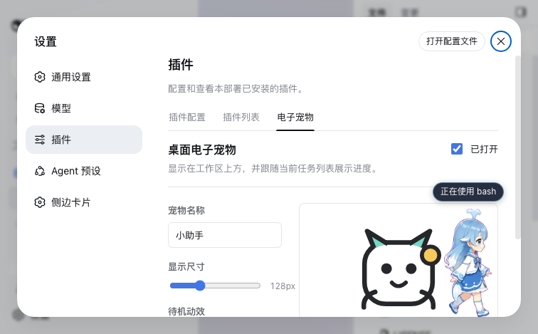

# DSH Desktop Pet

English | [中文](README.md)

[](https://github.com/guojiangli/dsh-plugin-desktop-pet/actions/workflows/ci.yml)
[](https://www.npmjs.com/package/@liguojiang/dsh-plugin-desktop-pet)
[](LICENSE)

A desktop pet plugin for DeepSeek Harness Web. The pet floats above the workspace, can be dragged or closed, accepts a custom image, and reflects the current session state and task progress.



## Features

- Draggable pet in the DSH shell overlay
- Close from the pet and reopen from Settings
- PNG, JPEG, WebP, and GIF upload up to 2 MB
- Editable name, size, and idle animation
- Current-session running state
- Active task and completion count when DSH publishes the `todos` projection
- Configuration under Settings > Plugins > Desktop Pet
- Light/dark theme tokens and reduced-motion support

## Compatibility

- DeepSeek Harness: `0.1.0-rc.6`
- Node.js: `>=20`
- Browser: modern browsers supported by DSH Web

## Install

Install from npm:

```bash
dsh plugin --profile web add @liguojiang/dsh-plugin-desktop-pet
```

Restart `dsh web`, then open Settings > Plugins > Desktop Pet.

Install the development version from GitHub:

```bash
dsh plugin --profile web add github:guojiangli/dsh-plugin-desktop-pet
```

Uninstall:

```bash
dsh plugin --profile web remove @liguojiang/dsh-plugin-desktop-pet
```

## Privacy

The plugin has no server endpoint and does not upload images. Configuration and custom images are stored as a Data URL in the current browser's `localStorage`. Clearing site data also clears the pet configuration.

## Known limitations

- Settings are local to the current browser and site; they do not sync across devices.
- Browser storage is limited, so each image is capped at 2 MB.
- Task progress appears only when the current session provides the `todos` projection. Otherwise the pet shows only running or idle state.
- A newly installed DSH client plugin requires a `dsh web` restart before it joins the client roster.

## Development

```bash
pnpm install
pnpm build
pnpm test
pnpm check
```

Source lives in `src/`; generated artifacts live in `lib/`. `scripts/build.mjs` uses esbuild to produce the DSH `window.__ModuleLoader__` client bundle, while TypeScript emits public declarations.

Install the current checkout locally:

```bash
dsh plugin --profile web add .
```

## Contributing

Read [CONTRIBUTING.md](CONTRIBUTING.md) and [CODE_OF_CONDUCT.md](CODE_OF_CONDUCT.md) before contributing. Report security issues privately as described in [SECURITY.md](SECURITY.md).

## License

[MIT](LICENSE) © 2026 guojiangli
